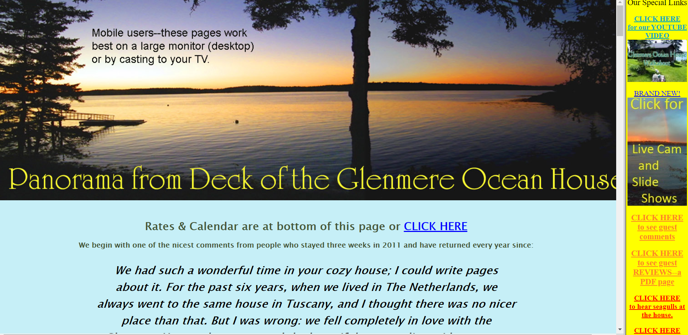
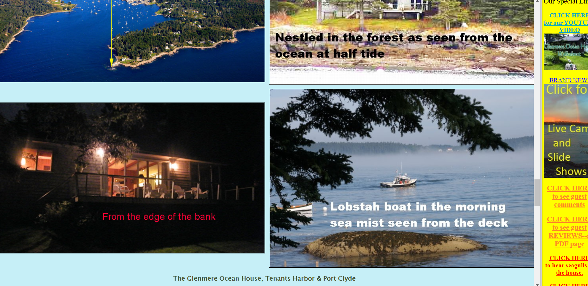
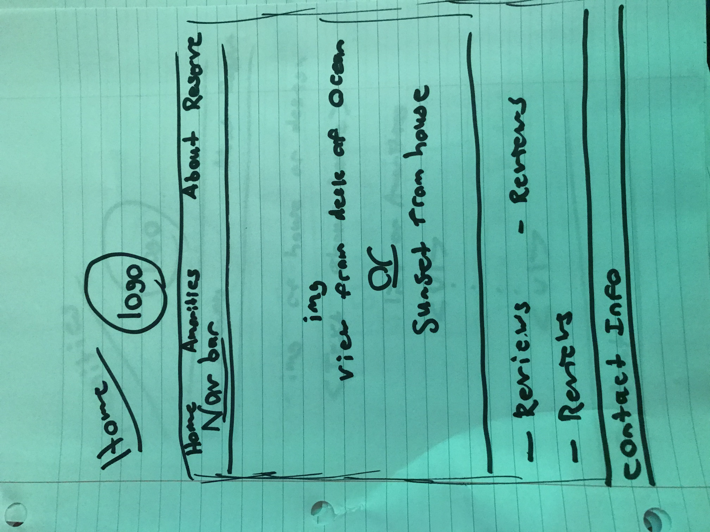
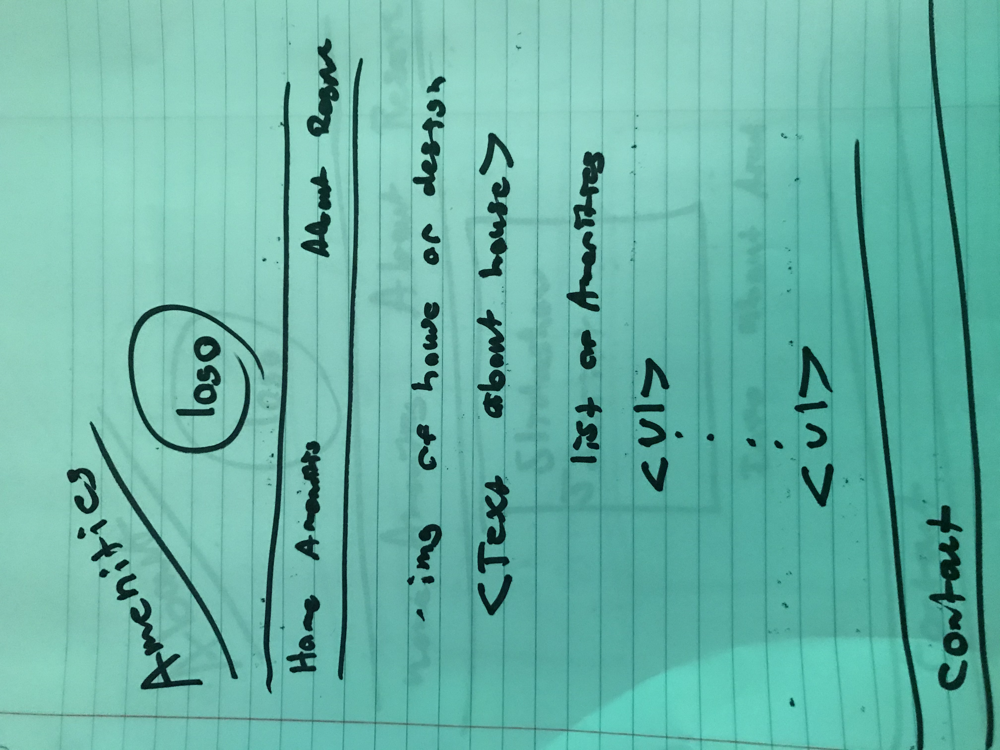
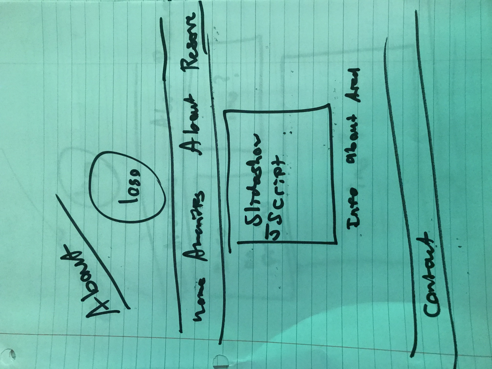
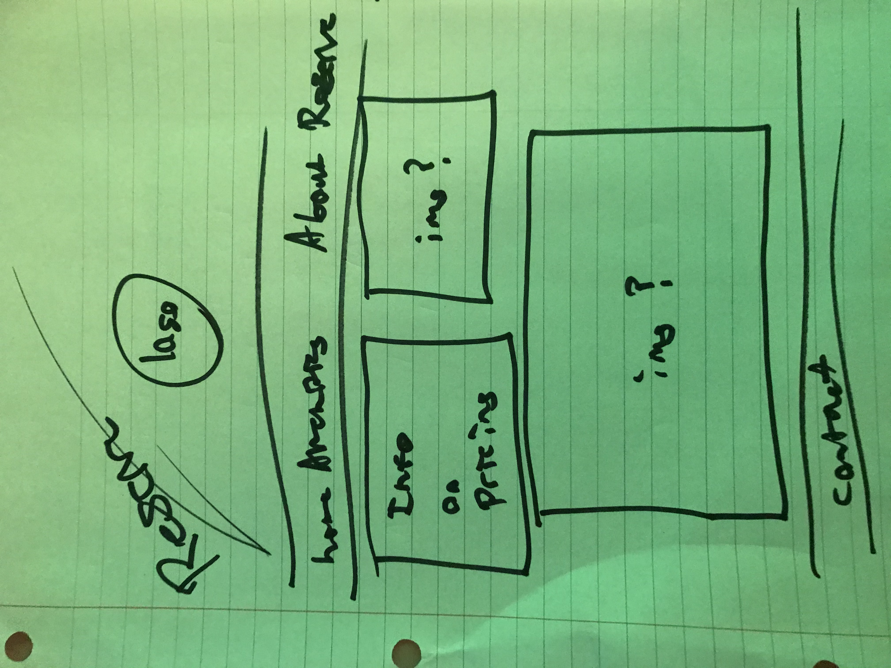
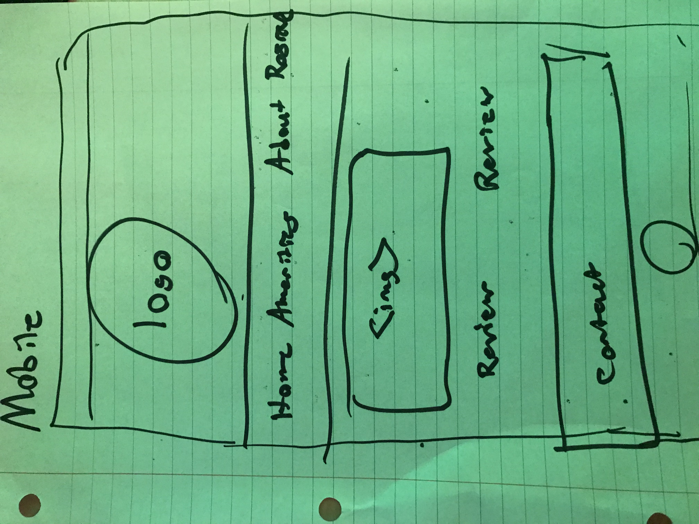
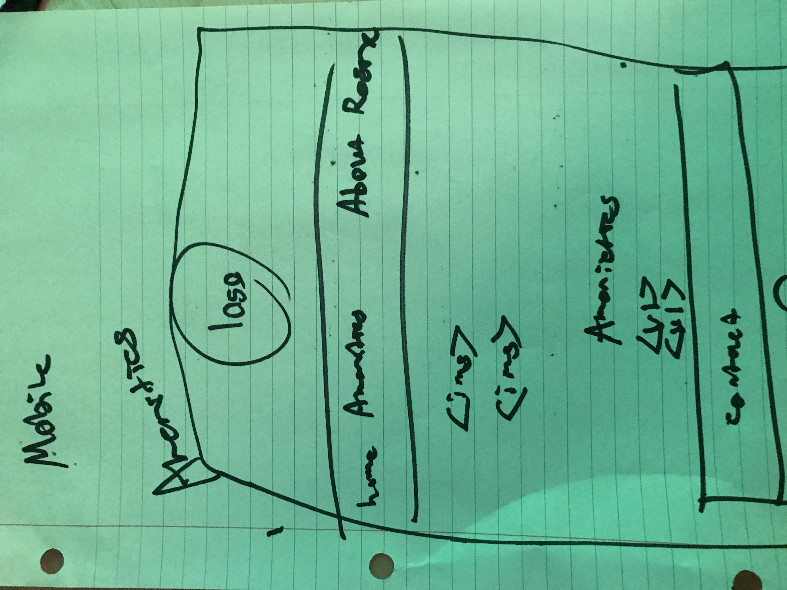
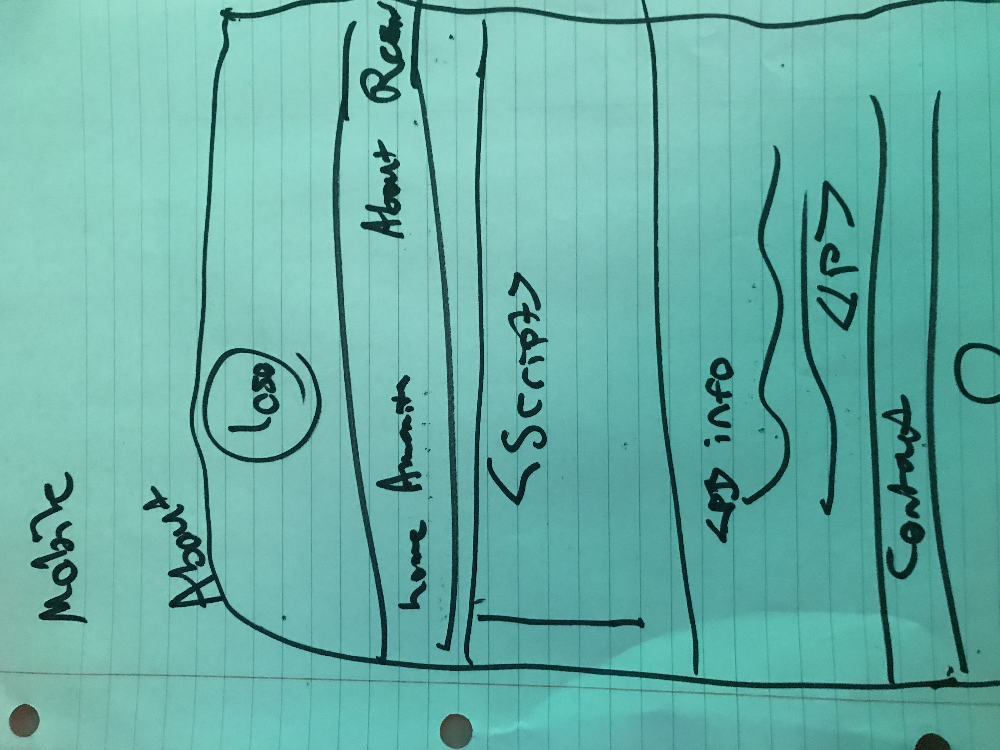
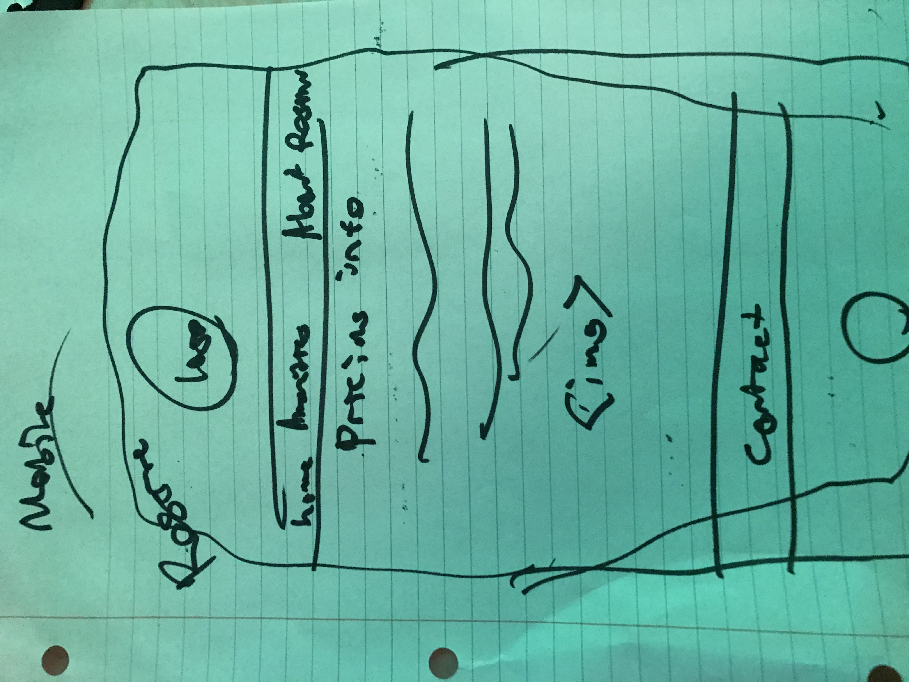

# Project 4 - Design & Plan

Be clear and concise in your writing. Bullets points are acceptable.

# Planning

## Client Description (Milestone 1)
> Tell us about your client. Who is your client? What kind of website do they want? What are their key goals?

My client is the owner of a small cottage in Maine, the Glenmere Ocean House. He is an older man in his 70s who rents out the cottage during the summer and early fall. My client's key goals are to create an updated website that showcases the beauty of the house and is presented in concise, sleek platform. The goal is to attract more potential guests to rent the house with a new website.

> NOTE: **If you are redesigning an existing website, give us the current URL and some screenshots of the current site.** Tell us how you plan to update the site in a significant way that meets the Project 4 requirements.

glenmerehouse.com

## Site's Purpose (Milestone 1)
> Tell us the purpose of the website and what it is all about.

The purpose of the website is to attract potential customers to rent out the house during summer and early fall. The goal of the site is to provide a current professional looking website that showcases Maine and garners interest from potential guests. The Glenmere house is in a beautiful but secluded area that does not get very much attention. The site will aim to give the house and surrounding area more exposure to attract more guests in coming years than those previous.

## Client Meeting Notes (Milestone 1)
> Include your notes/minutes from the client meeting, an email they sent you, or whatever you used to keep track of what was discussed at the meeting.

-Client felt old website was too cluttered.
-Was interested in creating a simpler website.
-Client wanted to use updated HD pictures he took over the last summer.
-Client was focused on making the house more appealing and promoting the idea of a relaxing remote vacation.
-Theme of the site was discussed with the client. It was determined that a site with whites and blues would like best in contrast to the somewhat jarring colors on the previous website on the sidebar and in text throughout.

## Client Needs and Wants (Milestone 1)
> Collect your client's needs and wants for the website. Come up with several appropriate design ideas on how those needs may be met. In the **Memo** field, justify your ideas and add any additional comments you have. There is no specific number of needs required for this, but you need enough to do the job.

Needs/Wants: [Brief Title]
- **Needs and Wants** [What does your client need and want?]
  - TODO
  Client needs a concise site promoting the house as a summer vacation opportunity. Wants to increase amount of guests as well as keep previous guests returning each year.
- **Design Ideas and Choices** [How will you meet those needs and wants?]
  - TODO
  I want to promote the beauty of Maine and the Port Clyde area. The main draw for the vacation is the ocean and sites close to the house. Want to make it clear that the vacation is a relaxing one with beautiful views. Light colors and updated pictures will be a large part. Maybe a slideshow of pictures with nice views.
- **Memo** [Justify your decisions; additional notes.]
  - TODO
    Using light themes and HD pictures of views will attract guests. Main goal is to illustrate that it is a beautiful vacation experience.
Need/Want: ...

## User(s) (Milestone 1)
> Tell us about the users (target audience) for this website.

The target audience is any adult wanting a summer vacation. The target audience would be most likely people from the North Eastern area of America. Target audience would be adults willing to go on summer vacations and open to traveling to Maine during the summer.

## Discovering Users' Needs (Milestone 1)
> You'll need to discover your users' needs. Talk to them! Document what you've learned about them. When talking to your users, take notes and include those notes here.

Users want to see scenery. They want to know how much renting the house will cost. Need to see what the house has. Appliances, electronics, bedrooms etc. Want to see views of house and what the area has to offer.

## Users' Needs (Milestone 1)
> Analyze the users' needs and wants from your notes above. List each need/want below. There is no specific number of needs required for this, but you need enough to do the job.
> **Note:** These are probably *not* the needs of your client.

Need/Want: [Brief Title]
- **Needs and Wants** [What do the users need and want?]
  - TODO
  Pictures of views,
  Pricing,
  Amenities, electronics offered,
  Availability,
  Past experience/reviews
  Pictures of house/property
- **Design Ideas and Choices** [How will you meet those needs and wants?]
  - Include pricing page, slideshow of pictures, target pictures with nice views, include page for house and what it includes, electronics, beds, etc. Throw in a few positive reviews, include rates of the year.
- **Rationale & Additional Notes** [Justify your decisions; additional notes.]
  - TODO

Need/Want: ...

## User Testing Plan (Milestone 1)
> Plan out your tasks for evaluating whether your site will meet the needs of the users. These must be actual user testing tasks. Tasks are not questions!

1. Find out how much it costs to rent the house.

2. Find pictures of the area and house.

3. Figure out what is included with the house and what electronics will be provided.

4. Figure out information about the surrounding area of the house.

## Content (Milestone 1)
> Plan out your site's content (text, images, etc.). Make a list of **all** the content you will need. This list should be **exhaustive**.

- TODO
- TODO
- Info about whats included in house, paragraph
- picture of rates/pricing/
- picture of view from house of Ocean
- picture of sunset
- multiple ocean pictures
- pictures of famous landmarks around area etc.
- brief sentences about Area
- Reviews, look for positive upbeat Reviews
- pictures of house
- Help create a logo branding the house Glenmere Ocean House. The client does not currently have a design so I will be creating a logo for the site.

## Interactivity Ideas (Milestone 1)
> Come up with some idea for interactive features for your site.

Some sort of slide show showcasing the house and area. The view and the surrounding area of Port Clyde are the biggest selling points for potential guests.

# Design & Evaluation

## Interactivity (Milestone 1)
> What interactive features will your site have? Describe how the interactivity connects with the needs of the clients/target audience.

Site will include a slideshow to showcase the scenery. The goal of the site is to garner interest and the biggest selling point is the beautiful scenery in Maine. Hopefully this makes guests more interested in renting out the house for weeks at a time.

## Final Design (Milestone 1)
> Include the final sketches for each of your pages. These sketches **must** hand-drawn.

**Desktop Design:**

**Mobile Design:**

## Additional Comments (Milestone 1)
> If you feel like you haven't fully explained your design choices, or if you want to explain some other functions in your site (such as special design decisions that might not meet the Project 4 requirements), you can use this space to justify your design choices or ask other questions about the project and process.

For my interactivity I chose to go with an animated slideshow that changes the picture every few seconds. I liked this design better than a slide show where the user manually clicked through with implementation of addClass and hidden functions. I liked how it makes the about page look and it seems more sophisticated than a manually run gallery.

---

# Iteration 2

## Client Feedback (Milestone 2)
> You have met once with your client a second time to discuss your initial design. Include your notes from the meeting, an email they sent you, or whatever you used to keep track of what was discussed at the meeting. Write a few sentences about the design feedback you received from your client.

The client really liked the logo design but was a little unsure of the very light blue color I was using. I changed it to be slightly darker and more blue. The client also liked the layout of the home page. For the amenities page the client wanted to have a clean professional feel. I chose to implement drawn images to add to the page design and include artwork other than using photographs of Maine scenery around the house.

# Iteration 3

## Additional Comments (Milestone 3)
> If you feel like you haven't fully explained your design choices, or if you want to explain some other functions in your site (such as special design decisions that might not meet the Project 4 requirements), you can use this space to justify your design choices or ask other questions about the project and process.

---

# Final Evaluation

## Changes Based on Lab 13 Peer Feedback (Final Submission)
> What changes did you make to your design based on your peers' feedback?

## User Testing
> If you conducted user testing in Milestone 1, you only need to user test 2 more users. Otherwise, you must conduct user testing with 4 users.

### User 3 - Testing Notes (Final Submission)
> When conducting user testing, you should take notes during the test. Place your notes here.

### User 3 (Final Submission)
> Using your notes from above, describe your user by answering the questions below.

1. Who is your user, e.g., where does the user come from, what is the user's job, characteristics, etc.?
User is a 24 year old woman who recently graduated college and is working in Boston full time. Prior vacations have been to Florida and North Carolina.

2. Does the user belong to your target audience of the site? (Yes / No)
> If “No”, what’s your strategy of associating the user test results to your target audience’s needs and wants? How can your re-design choices based on the user tests make a better fit for the target audience?

Yes

### User 3 - **Desktop** (Final Submission)
> Report the results of your user's evaluation. You should explain **what the user did**, describe the user's **reaction/feedback** to the design, **reflect on the user's performance**, determine what **re-design choices** you will make. You can also add any additional comments. See the example design journey for an example of what this would look like.

Task: Find out how much it costs to rent the house.
- **Did you evaluate the desktop or mobile design?**
  - Pick one: desktop/mobile
  Desktop
- **How did the user do? Did they meet your expectation?**
  - The user met the expectation and was able to locate the pricing under the reservations page on the nav bar.
- **User’s reaction / feedback to the design** (e.g., specific problems or issues found in the tasks)
  - User commented on picture on home page saying it looked nice. User navigated the site easily but commented some things about the price being expensive and not having a huge interest in Maine.
- **Your reflections about the user’s performance to the task**
  - The user performed the task adequately but unsure if the user would be a potential guest in the future.
- **Re-design choices**
  - None
- **Additional Notes**
  - TODO: Justify your decisions; additional notes.

...

### User 4 - Testing Notes (Final Submission)
> When conducting user testing, you should take notes during the test. Place your notes here.

### User 4 (Final Submission)
> Using your notes from above, describe your user by answering the questions below.

1. Who is your user, e.g., where does the user come from, what is the user's job, characteristics, etc.?

User is a 50 year old woman. User is from Northeast Ohio and works at a law firm.

2. Does the user belong to your target audience of the site? (Yes / No)
> If “No”, what’s your strategy of associating the user test results to your target audience’s needs and wants? How can your re-design choices based on the user tests make a better fit for the target audience?

Yes

### User 4 - **Mobile** (Final Submission)
> Report the results of your user's evaluation. You should explain **what the user did**, describe the user's **reaction/feedback** to the design, **reflect on the user's performance**, determine what **re-design choices** you will make. You can also add any additional comments. See the example design journey for an example of what this would look like.

Task: Find pictures of the area and house.
- **Did you evaluate the desktop or mobile design?**
  - Pick one: desktop/mobile
  Mobile
- **How did the user do? Did they meet your expectation?**
  - The user found pictures on the main page and on the about page. The site navigation worked and the user noted that the pictures of the area were nice.
- **User’s reaction / feedback to the design** (e.g., specific problems or issues found in the tasks)
  - User noted that the slideshow pictures were cropped a little too much. Also noted that there was no picture of the outside of house. User liked the picture on the home page.
- **Your reflections about the user’s performance to the task**
  - I need to add a picture of the house from the outside in the slideshow. Unsure about changing cropped images since it is responsive for mobile.
- **Re-design choices**
  -  Picture of house from outside of porch was attained from client and added to slideshow.
- **Additional Notes**
  - TODO: Justify your decisions; additional notes.

...

### User 5 - Testing Notes (Final Submission)
> When conducting user testing, you should take notes during the test. Place your notes here.

### User 5 (Final Submission)
> Using your notes from above, describe your user by answering the questions below.

1. Who is your user, e.g., where does the user come from, what is the user's job, characteristics, etc.?
User is a 48 year old man who works in IT at an audiobook company. Lives in northeast Ohio.

2. Does the user belong to your target audience of the site? (Yes / No)
> If “No”, what’s your strategy of associating the user test results to your target audience’s needs and wants? How can your re-design choices based on the user tests make a better fit for the target audience?

Yes

### User 5 - **Desktop** (Final Submission)
> Report the results of your user's evaluation. You should explain **what the user did**, describe the user's **reaction/feedback** to the design, **reflect on the user's performance**, determine what **re-design choices** you will make. You can also add any additional comments. See the example design journey for an example of what this would look like.

Task: Figure out what is included with the house and what electronics will be provided.
- **Did you evaluate the desktop or mobile design?**
  - Pick one: desktop
- **How did the user do? Did they meet your expectation?**
  - User found information on the amenities page. Met expectation and got an overview of inclusions in house.
- **User’s reaction / feedback to the design** (e.g., specific problems or issues found in the tasks)
  - User liked the look of the page with drawn symbols. Asked if there was a firepit at the house. User commented positively on design. Wanted added pictures of house interior. Liked the logo design wanted more implementation of it.
- **Your reflections about the user’s performance to the task**
  - User was inquisitive about the house. Design reaction was positive.
- **Re-design choices**
  - Unfortunately the client does not have any high quality pictures of the house interior. Old pictures on previous website were in poor quality and would go against the sight design. In the future the client will take HD pictures of the house interior and they will be implemented to the site. Logo was added to bottom bar of all pages.
- **Additional Notes**
  - TODO: Justify your decisions; additional notes.

...

### User 6 - Testing Notes (Final Submission)
> When conducting user testing, you should take notes during the test. Place your notes here.

### User 6 (Final Submission)
> Using your notes from above, describe your user by answering the questions below.

1. Who is your user, e.g., where does the user come from, what is the user's job, characteristics, etc.?
User is a 19 year old college student from Northeast Ohio. Although he does not have a job he vacations often with his family.

2. Does the user belong to your target audience of the site? (Yes / No)
> If “No”, what’s your strategy of associating the user test results to your target audience’s needs and wants? How can your re-design choices based on the user tests make a better fit for the target audience?

Yes, from northeast but without a personal source of income to pay for reservation.

### User 6 - **Mobile** (Final Submission)
> Report the results of your user's evaluation. You should explain **what the user did**, describe the user's **reaction/feedback** to the design, **reflect on the user's performance**, determine what **re-design choices** you will make. You can also add any additional comments. See the example design journey for an example of what this would look like.

Task: 4. Figure out information about the surrounding area of the house.
- **Did you evaluate the desktop or mobile design?**
  - Pick one: mobile
- **How did the user do? Did they meet your expectation?**
  - User went to the about page looking at the mobile version. The slideshow worked adequately and the user read information about the area underneath it. This met the expectation and the about page was useful.
- **User’s reaction / feedback to the design** (e.g., specific problems or issues found in the tasks)
  - User reacted positively to slideshow. Wanted additional info on surrounding area of Port Clyde. User noted on the reservations page the images overlapped the screen and hung over the side. Only half the pictures were on the website in line with the nav bar.
- **Your reflections about the user’s performance to the task**
  - The user found good information on the area around the Glenmere house. Found a flaw in reservations page with images overlapping website page.
- **Re-design choices**
  - Css needs to be fixed for reservations for both the rates img and the picture of the sunset over the ocean.
- **Additional Notes**
  - TODO: Justify your decisions; additional notes.

...

## Changes Based on User Testing (Final Submission)
> What changes did you make to your design based on user testing?

Incorrect css was fixed. Pictures were added of the Glenmere house. More information was added about surrounding area. Logo was added to bottom of all pages.

## Final Notes to the Graders (Final Submission)
> 1. Give us three specific strengths of your site that sets it apart from the previous website of the client (if applicable) and/or from other websites. Think of this as your chance to argue for the things you did really well.

The website has been cleaned up significantly from the previous website. Unnecessary text was removed and the layout was changed to introduce a navigation bar giving the website a more professional, ordered feel.

The color scheme was changed to whites and blues. No yellow or reds in backgrounds or any text. It is much more pleasing to look at.

Pictures added were in high definition and ordered well. Information is no longer scattered and is provided in an easy to find ordered fashion. The addition of a logo helps brand the house and gives the site added professionalism.

> 2. Tell us about things that don't work, what you wanted to implement, or what you would do if you keep working with the client in the future. Give justifications.

I would have liked to implement sound bites of seagulls taken by my client in certain portions of the website to give a more immersive experience. I also would have liked to add a youtube link of a walking tour of the house.

> 3. Tell us what you, as a team, learned while working on this project.

> 4. Tell us anything else you need us to know for when we're looking at the project.
